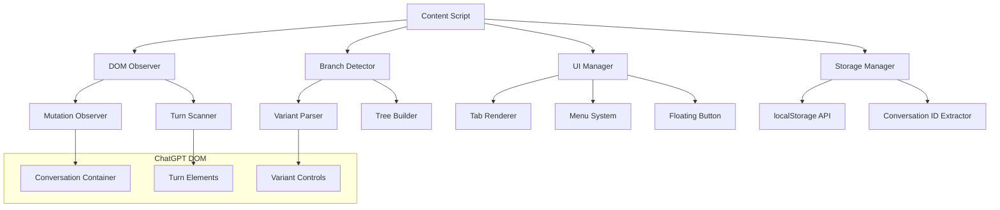

# Design Document

## Overview

The ChatGPT Branching Extension is a Chrome extension that enhances conversation branch navigation through an incremental, DOM-only approach. The extension observes ChatGPT's interface to detect variant indicators, builds a conversation tree progressively as users navigate, and provides an intuitive tabbed interface for branch management. The design emphasizes lightweight operation, reliable DOM detection, and persistent user customizations.

## Architecture

### High-Level Components



### Extension Structure

- **manifest.json**: Chrome extension configuration with content script permissions
- **content.js**: Main content script injected into ChatGPT pages
- **styles.css**: Extension UI styling that integrates with ChatGPT's design
- **background.js**: Service worker for extension lifecycle management (minimal)

## Components and Interfaces

### 1. DOM Observer (`DOMObserver`)

**Purpose**: Monitors ChatGPT's conversation container for changes and triggers branch detection.

**Key Methods**:

- `initialize()`: Sets up MutationObserver on conversation container
- `onMutation(mutations)`: Handles DOM changes and triggers relevant updates
- `scanVisibleTurns()`: Performs initial scan of existing conversation turns

**DOM Targets**:

- Primary container: `main` or `[role="main"]` containing conversation
- Turn elements: `[data-testid="conversation-turn"]`, `article`, `li[role="listitem"]`
- Variant controls: Elements with `.tabular-nums` matching `/^\d+\/\d+$/`

### 2. Branch Detector (`BranchDetector`)

**Purpose**: Identifies conversation branches and builds the conversation tree incrementally.

**Key Methods**:

- `detectBranches(turnElements)`: Scans turns for variant indicators
- `parseVariantInfo(turnElement)`: Extracts variant count and current index
- `generateTurnId(turnElement)`: Creates stable identifier for turns
- `classifyTurnRole(turnElement)`: Determines if turn is user or assistant

**Detection Algorithm**:

```javascript
function detectBranches(turnElements) {
  const branches = [];

  for (const turn of turnElements) {
    const variantCounter = turn.querySelector(".tabular-nums");
    const prevButton = turn.querySelector(
      'button[aria-label="Previous response"]'
    );
    const nextButton = turn.querySelector('button[aria-label="Next response"]');

    if (variantCounter && variantCounter.textContent.match(/^\d+\/\d+$/)) {
      const [current, total] = variantCounter.textContent
        .split("/")
        .map(Number);
      branches.push({
        turnId: this.generateTurnId(turn),
        currentVariant: current,
        totalVariants: total,
        role: this.classifyTurnRole(turn),
        element: turn,
      });
    }
  }

  return branches;
}
```

### 3. Tree Builder (`TreeBuilder`)

**Purpose**: Maintains the conversation tree structure and relationships between variants.

**Data Structure**:

```javascript
{
    nodes: {
        [nodeId]: {
            id: string,
            turnIndex: number,
            variantIndex: number,
            totalVariants: number,
            role: 'user' | 'assistant',
            textHash: string,
            preview: string,
            timestamp: number,
            customName: string | null,
            color: string | null
        }
    },
    edges: {
        [parentId]: [childId1, childId2, ...]
    },
    currentPath: [nodeId1, nodeId2, ...],
    rootBranches: [nodeId1, nodeId2, ...]
}
```

**Key Methods**:

- `addNode(nodeData)`: Adds new node to tree
- `linkNodes(parentId, childId)`: Creates parent-child relationship
- `findRootBranches()`: Identifies top-level branch points
- `getSubBranches(nodeId)`: Returns child branches for a node
- `updateCurrentPath(path)`: Updates the active conversation path

### 4. UI Manager (`UIManager`)

**Purpose**: Renders and manages the extension's user interface elements.

#### Tab Renderer (`TabRenderer`)

**Responsibilities**:

- Renders root branch tabs at top of ChatGPT interface
- Handles tab interactions (click, double-click, right-click)
- Manages horizontal scrolling for overflow tabs

**Tab Structure**:

```html
<div class="branch-tabs-container">
  <div class="branch-tabs-scroll">
    <div
      class="branch-tab"
      data-branch-id="branch1"
      style="background-color: #color"
    >
      <span class="tab-label">Branch Name</span>
      <div class="tab-menu" hidden>
        <div class="color-picker">...</div>
      </div>
    </div>
  </div>
</div>
```

#### Menu System (`MenuSystem`)

**Responsibilities**:

- Creates hover menus for sub-branches
- Handles nested sub-menus for deeper branch levels
- Provides rename functionality with pencil icons

**Menu Structure**:

```html
<div class="branch-menu" data-parent-branch="branch1">
  <div class="menu-item" data-branch-id="subbranch1">
    <span class="item-label">Sub-branch Name</span>
    <button class="rename-btn" aria-label="Rename">✏️</button>
  </div>
  <div class="submenu" data-parent="subbranch1">
    <!-- Nested items -->
  </div>
</div>
```

#### Floating Button (`FloatingButton`)

**Responsibilities**:

- Renders fixed position button in top-right corner
- Shows placeholder modal for MVP
- Designed for future graph visualization integration

### 5. Storage Manager (`StorageManager`)

**Purpose**: Handles persistence of branch data and user customizations.

**Storage Schema**:

```javascript
// localStorage key: `branchMap:${conversationId}`
{
    version: "1.0",
    conversationId: string,
    lastUpdated: timestamp,
    tree: TreeBuilder.data,
    userCustomizations: {
        branchNames: { [branchId]: string },
        branchColors: { [branchId]: string }
    }
}
```

**Key Methods**:

- `saveConversationTree(conversationId, treeData)`: Persists tree to localStorage
- `loadConversationTree(conversationId)`: Retrieves saved tree data
- `updateBranchCustomization(branchId, customization)`: Saves user customizations
- `extractConversationId()`: Gets conversation ID from URL

### 6. Navigation Controller (`NavigationController`)

**Purpose**: Handles navigation between branches by programmatically clicking ChatGPT's controls.

**Key Methods**:

- `navigateToBranch(branchPath)`: Navigates to specific branch by clicking through variants
- `clickVariantButton(turnElement, direction)`: Clicks next/previous buttons
- `waitForNavigation()`: Waits for DOM updates after navigation
- `validateCurrentPath()`: Confirms navigation reached intended branch

## Data Models

### Branch Node

```typescript
interface BranchNode {
  id: string; // Unique identifier
  turnIndex: number; // Position in conversation
  variantIndex: number; // Current variant (1-based)
  totalVariants: number; // Total available variants
  role: "user" | "assistant"; // Message author
  textHash: string; // Content fingerprint
  preview: string; // First ~120 characters
  timestamp: number; // Discovery time
  customName?: string; // User-assigned name
  color?: string; // User-assigned color
}
```

### Conversation Tree

```typescript
interface ConversationTree {
  nodes: Map<string, BranchNode>;
  edges: Map<string, string[]>; // parent -> children
  currentPath: string[]; // Active branch path
  rootBranches: string[]; // Top-level branches
}
```

### User Customization

```typescript
interface BranchCustomization {
  name?: string;
  color?: string;
}
```

## Error Handling

### DOM Detection Failures

- **Fallback Selectors**: Use multiple selector strategies for turn detection
- **Graceful Degradation**: Continue operation even if some branches aren't detected
- **Retry Logic**: Re-scan after DOM mutations if initial detection fails

### Navigation Errors

- **Validation**: Verify navigation reached intended branch
- **Timeout Handling**: Cancel navigation attempts that take too long
- **State Recovery**: Restore previous state if navigation fails

### Storage Errors

- **Quota Management**: Handle localStorage quota exceeded errors
- **Data Validation**: Validate stored data structure before use
- **Migration**: Handle schema changes between extension versions

### Performance Safeguards

- **Throttling**: Limit DOM scanning frequency during rapid changes
- **Batch Updates**: Group multiple tree updates into single operations
- **Memory Management**: Clean up unused event listeners and observers

## Testing Strategy

### Unit Tests

- **Branch Detection**: Test variant parsing with various DOM structures
- **Tree Building**: Verify correct parent-child relationships
- **Storage Operations**: Test persistence and retrieval of branch data
- **Navigation Logic**: Mock DOM interactions for branch navigation

### Integration Tests

- **DOM Observer**: Test MutationObserver behavior with simulated ChatGPT changes
- **UI Rendering**: Verify tab and menu rendering with different branch structures
- **End-to-End Navigation**: Test complete user workflows from detection to navigation

### Manual Testing Scenarios

1. **Basic Branch Creation**: Edit message, verify branch detection
2. **Deep Branching**: Create multiple levels of sub-branches
3. **Customization**: Rename branches and assign colors
4. **Persistence**: Reload page, verify customizations persist
5. **Performance**: Test with conversations containing many branches

### Browser Compatibility

- **Chrome**: Primary target (Manifest V3)
- **Edge**: Secondary target (Chromium-based)
- **DOM Variations**: Test with different ChatGPT interface versions

## Security Considerations

### Content Security Policy

- **Inline Styles**: Use CSS classes instead of inline styles where possible
- **Script Injection**: Avoid eval() and dynamic script creation
- **DOM Manipulation**: Sanitize any user-provided content

### Data Privacy

- **Local Storage Only**: No external data transmission
- **Conversation Content**: Store only metadata, not full message content
- **User Consent**: Clear about what data is stored locally

### Extension Permissions

- **Minimal Scope**: Request only necessary permissions
- **Host Permissions**: Limit to ChatGPT domains only
- **API Access**: Use only required Chrome extension APIs
